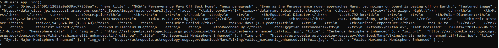
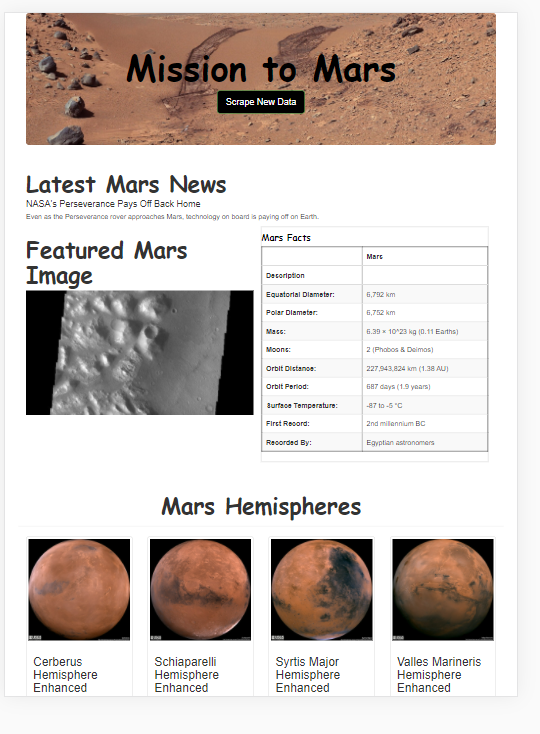
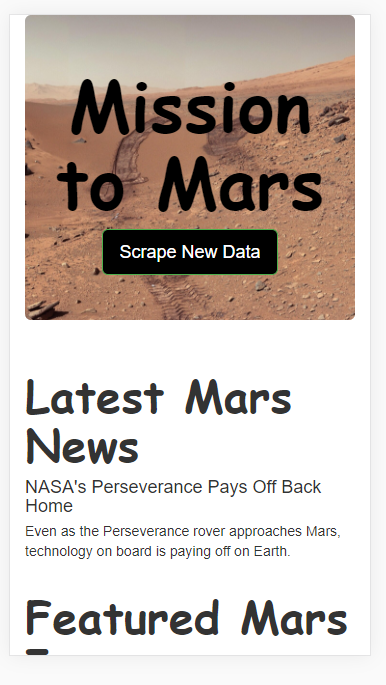

# Overview of Project:

The purpose here was to put together a web scraping project who allowed us to get latest news an update by a click of a button with a narrow focus on a single topic. For this case the topic being the planet Mars. 
Then we used a web application (flask) to showcase our finding as well as a non-relational database (MongoDB) to store our data.

# Results:

As the web scraping being put in place, we were able to showcase:
- Latest full resolution image of Mars.
- Latest articles news about the planet Mars.
- A table containing a lot of information on Mars facts.
- Full resolution images of Mars's hemisphere as well as their information.
- Store all gathered data into a MongoDB. 

Then using HTML code and Bootstrap components, we customized the appearance of the webpage, and also made it mobile responsive, like that it could be access on different kind of device (Desktop, tablet or phone). 

For example: 
- Ipad pro. 
 
- Galaxy 5. 
 

# Summary:

At the click of a button in our web application, we could access the latest news, full resolution images and useful facts about the planet Mars.
